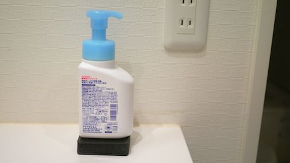
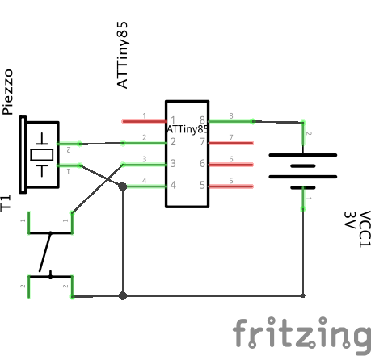
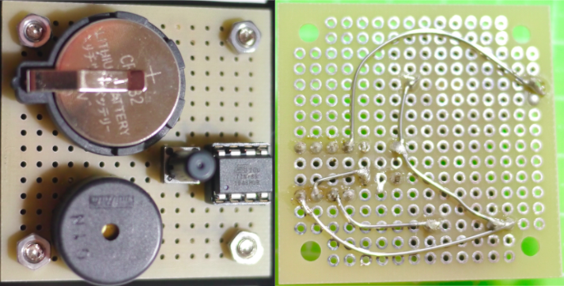
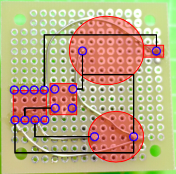
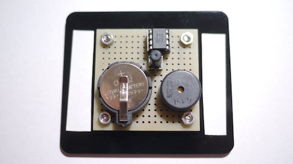
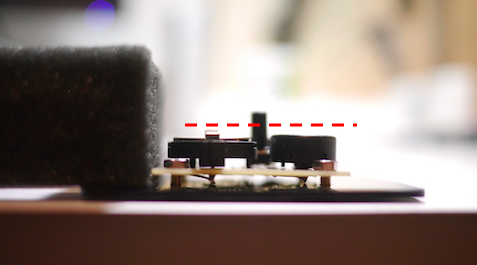
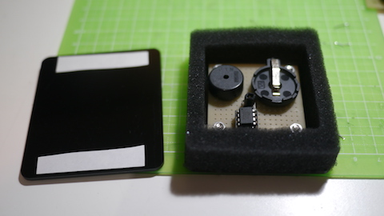
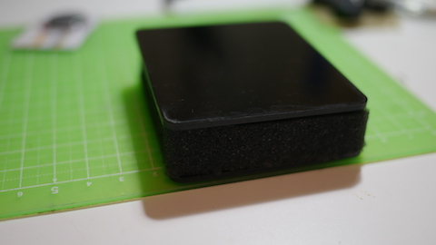

# 石鹸を出すと30秒音のなるハンドソープ台

## 概要

ハンドソープをプッシュすると、30秒間の曲が鳴る台です。我が家では、これを導入してから[子供がきっちり30秒間丁寧に手を洗うようになってくれました](https://twitter.com/kenkawakenkenke/status/1246731640165957638)。

## 必要なもの

### 工作キットを購入した場合

[工作キット](https://kenkawakenkenke.stores.jp/items/5eab6c5472b9115e7e576797)を購入いただいた場合、他に必要なものは：

 * [はんだごて](https://www.amazon.co.jp/s?k=%E3%81%AF%E3%82%93%E3%81%A0%E3%81%94%E3%81%A6&__mk_ja_JP=%E3%82%AB%E3%82%BF%E3%82%AB%E3%83%8A&ref=nb_sb_noss_1)
 * [はんだ](https://www.amazon.co.jp/s?k=%E3%81%AF%E3%82%93%E3%81%A0&__mk_ja_JP=%E3%82%AB%E3%82%BF%E3%82%AB%E3%83%8A&ref=nb_sb_noss)
 だけです。
 
### 自分で部品を用意する場合

上記に加え、以下の部品を用意しましょう：

 * [ATTiny85](http://akizukidenshi.com/catalog/g/gI-09573/)：[HandWashTimer85のプログラム](Arduino/HandWashTimer85.ino)を書き込んでください。
 * [ユニバーサル基板](http://akizukidenshi.com/catalog/g/gP-11735/)：なんでもいいですが、ピン数が16x16以上必要です。
 * [圧電スピーカー](http://akizukidenshi.com/catalog/g/gP-04119/)
 * [CR2032電池ホルダー](http://akizukidenshi.com/catalog/g/gP-00706/)
 * [CR2032電池](http://akizukidenshi.com/catalog/g/gB-05694/)
 * [タクトスイッチ](http://akizukidenshi.com/catalog/g/gP-09623/)：他の部品よりも背が高いものを選んでください
 * ケース：基板を設置し、ハンドソープを乗せるためのケースを用意しましょう。[工作キット](https://kenkawakenkenke.stores.jp/items/5eab6c5472b9115e7e576797)にはちょうどよいアクリルケースが付属しています。

### 基板を組み立てる

以下の回路図を参考に、基板を組立ててください：

 * マイコンと電池は熱に弱いため、はんだ付け時はソケットから抜いておきましょう。
 * 部品には向きがあります。下記写真を参考にしてください。

参考までに、部品はこんな感じで置くときれいに収まります。特に、トグルスイッチをなるべく真ん中に置くと、ソープを押したときの安定性が増します。

添付のスズメッキ線を使って丁寧に配線してください。

電池とマイコンをセットして、タクトスイッチを押したら30秒間曲がなるはずです。

### 本体の組み立て
まずは底面アクリル（穴が空いたほう）に基板をネジ止めしましょう。

次に、必要に応じてトグルスイッチの高さを調整します。出荷直後の状態だと、トグルスイッチの背が高すぎて本体の安定性が悪い場合があります。そのため、他の部品よりも数mmだけ高いように、スイッチ上部を切断しましょう：

アクリルについている両面テープの保護材を剥がして、付属のスポンジをくっつけましょう。

上面のアクリルを同じようにくっつけて、完成です。

ハンドソープを上において、プッシュしたら曲がなることを確認しましょう。

## 好きな音楽をプログラミングする
TODO(ken): 書く

キットに付属しているマイコン（ATTiny85）は、すでに30秒間の威風堂々が鳴るようにプログラムされています。これをご自身の書いたプログラムで置き換えることで、好きな曲に変えたり、別の挙動をさせたりすることができます。

1. [こういうガイド](https://miraluna.hatenablog.com/entry/tiny85)を見ながら、ATTiny85にArduinoのスケッチを書き込める環境を整えましょう。

2. 本プロジェクトの[デフォルトのプログラム]((Arduino/HandWashTimer85.ino))をダウンロードして、好きに改変してみましょう。

3. 面白いのができたらSNSに投稿しましょう。
