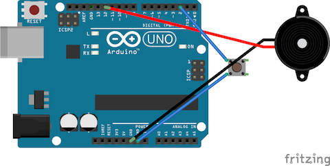
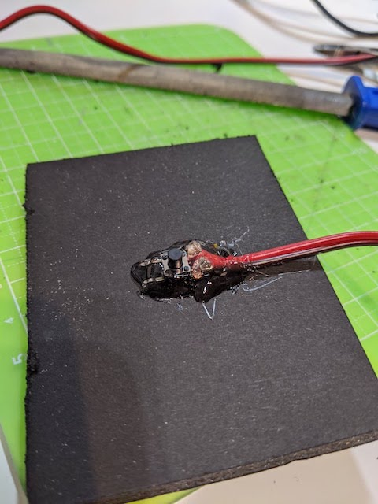
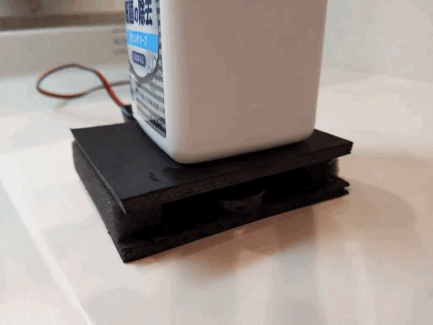

# Music hand wash timer
## Overview
A hand soap stand that plays music (Pomp and Circumstances) for 30 seconds ([as suggested by WHO](https://www.who.int/gpsc/5may/Hand_Hygiene_Why_How_and_When_Brochure.pdf)).
See [it in action in this video](https://twitter.com/kenkawakenkenke/status/1246731640165957638).

## Build one yourself
### 1. Build the electronics

You need:

 * An Arduino (e.g: [Arduino UNO](https://amzn.to/2UKaE1F))
 * [A piezzo speaker](https://amzn.to/2RcIPg9)
 * [A tact switch](https://amzn.to/2wiRera)

Write the [sketch](Arduino/HandWashTimer.ino) to your Arduino.

### 2. Build the stand

On a piece of cardboard, glue your tactswitch in the middle.

