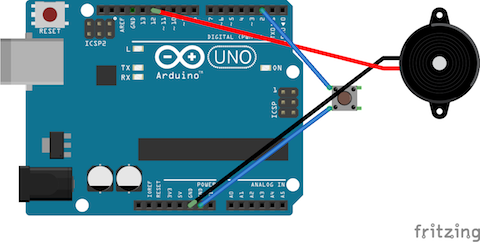
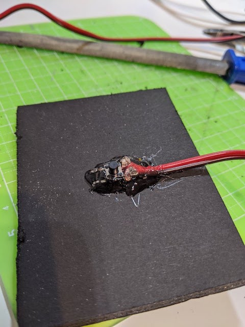

# Music hand wash timer
## Overview
A hand soap stand that plays music (Pomp and Circumstances) for 30 seconds ([as suggested by WHO](https://www.who.int/gpsc/5may/Hand_Hygiene_Why_How_and_When_Brochure.pdf)).
See [it in action in this video](https://twitter.com/kenkawakenkenke/status/1246731640165957638).

## Build one yourself
### 1. Build the electronics

You need:

 * An Arduino (e.g: [Arduino UNO](https://amzn.to/2UKaE1F))
 * [A piezzo speaker](https://amzn.to/2RcIPg9)
 * [A tact switch](https://amzn.to/2wiRera)

Wire up the components, and write the [sketch](Arduino/HandWashTimer.ino) to your Arduino.

### 2. Build the stand

On a piece of cardboard, glue your tact switch in the middle.

Place pieces of foam beside the switch, and glue another piece of cardboard above the switch and foam.
Make sure that you have just the right amount of foam: it shouldn't be so soft that the switch is pressed just from placing your soap bottle, and it shouldn't be so hard that dispensing soap doesn't allow your switch to be pressed.

Make sure you hide your electronics somewhere.

